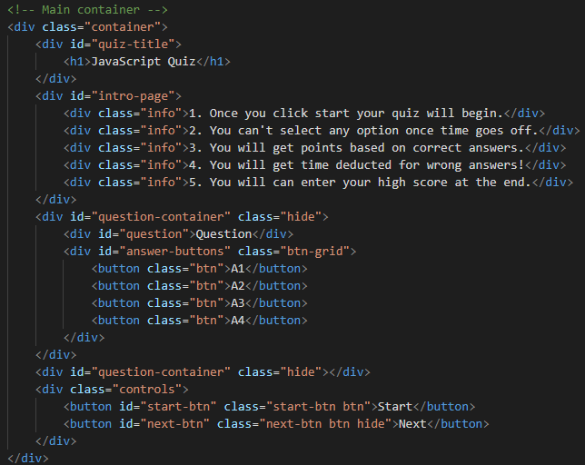
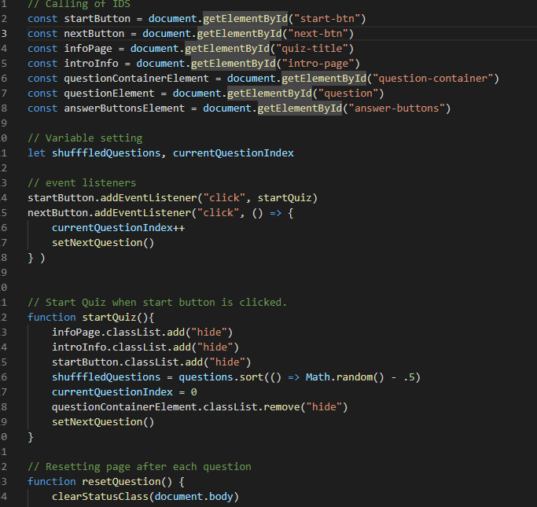
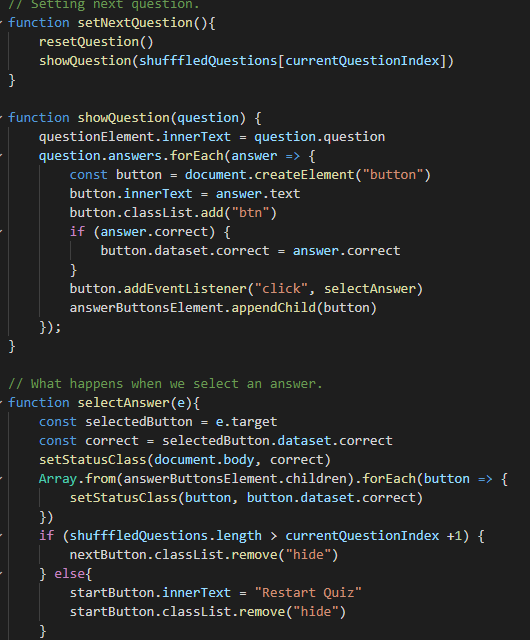
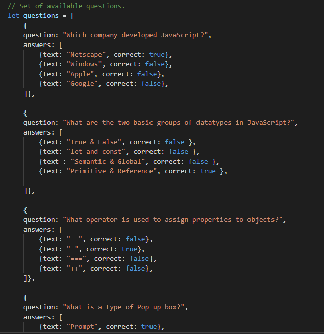
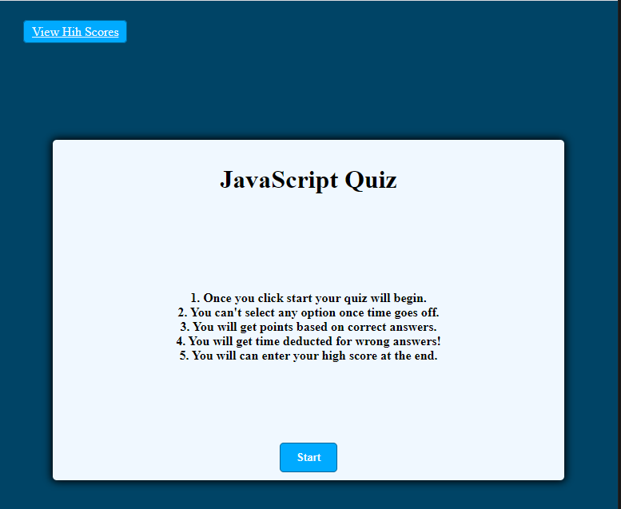
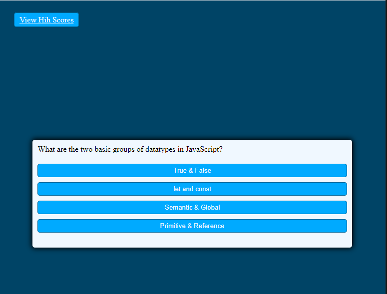

# HW4-CodeQuiz
## What was the purpose of this homework?
The purpose of this assigment is to create a quiz that:
* Starts with a description of the quiz.
* Has a start button to begin.
* Populates question and answers on the screen
* quiz demostrates if a correct or qrong answer was selected
* goes on to the next question
* after it's finished you can view high scores

## How do I plan to tackle this project?

Thes steps I plan to follow are:
* setting the html file to generalize the structure of my quiz.
* style it so that it is easier to work with in a css file
* adding a js file where it will hold most of my project
* start by creating the fuctions based on what the work logic of the quiz is (showing the questions one by one, doing something to show what answer was selected then going on to the next question until we run out)
* end page showing results of the quiz.

## What are some challenges that were encountered during this task?
* I had issues implementing the timer due to the time deduction process.

## What were some skills that were improved by performing this task?
* improved my understanding of objects, properties and functions.
* extended my knowledge of vanilla JS.

## Finished Code

## Finished quiz

[GitHub:] https://github.com/Milan1422/HW4-CodeQuiz
[GitHubPages:] https://milan1422.github.io/HW4-CodeQuiz/

